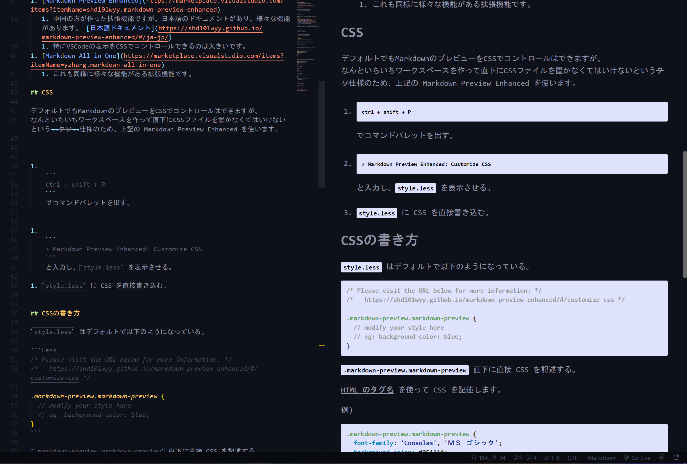

<!-- markdown_textbook -->

# 始めに

これは `Markdown` の　Textbook です。

Textbook とは言っていますが、ここでは後で述べるように、 <u>***記法についてはほとんど説明しません***</u>(?!)。 ここで説明するのは環境構築や実際に自分がつまずいた部分などです。 
めちゃくちゃわかりやすい解説が世の中にはたくさんあるので、下記のおすすめのサイトを見ることをおすすめします。


また話は変わりますが、Markdownを勉強する際に<u>***気をつけて欲しいこと***</u>があります。  
びっくりするかもしれませんが、<u>***Markdown には統一規格がありません***</u>。  
なので実装によって記法が異なることがあります。(共通とされている記法は意外と少なく、表現力が足りないことがあるのです。)

何かあれば著者(EaGitro Twitter: [EaGitro](https://twitter.com/EaGitro))にDMをください。


## 目次

- [始めに](#始めに)
  - [目次](#目次)
- [環境構築](#環境構築)
  - [Markdown with VSCode](#markdown-with-vscode)
    - [プレビュー機能](#プレビュー機能)
    - [拡張機能](#拡張機能)
    - [CSS](#css)
    - [CSSの書き方](#cssの書き方)
    - [例](#例)
- [記法](#記法)
  - [おすすめのサイト](#おすすめのサイト)
- [Tips!](#tips)
  - [記法についての Tips!](#記法についての-tips)
    - [改行と段落について](#改行と段落について)
      - [改行について](#改行について)
      - [段落分けについて](#段落分けについて)
    - [Tableについて](#tableについて)
      - [Table の基本](#table-の基本)
      - [Minimum Table](#minimum-table)
    - [ページ内リンクについて](#ページ内リンクについて)
      - [重複分について](#重複分について)
- [参考](#参考)
- [Author](#author)


# 環境構築

Markdown をプレビューできる便利なところとして、Github と VSCode があります。

今回は VSCode を使います。

しかしながら (しつこいですが)<u>***実装によって違いがあること***</u> に留意する必要があります。   
「VSCode ではいけたのに...」ということはしょっちゅうあり、またそれは他の実装でも同じことです。  
使う際には実際にどのように見えるかを常に考える必要があります。


## Markdown with VSCode

<u>***Markdown***</u> を <u>***表示・編集***</u> することができる便利なエディターとして <u>***VSCode***</u> 等があります。

VSCodeにおけるMarkdownの使い方を解説します。

### プレビュー機能

```
ctrl + K  ->  V
```
でプレビューされます。

この時、VSCodeのテーマカラーをもとに、背景やフォントの色をVSCode君がよしなにしてくれますが、それだと物足りないので以下の拡張機能を入れます。

### 拡張機能

1. [Markdown Preview Enhanced](https://marketplace.visualstudio.com/items?itemName=shd101wyy.markdown-preview-enhanced)
   1. 中国の方が作った拡張機能ですが、日本語のドキュメントがあり、様々な機能があります。 [日本語ドキュメント](https://shd101wyy.github.io/markdown-preview-enhanced/#/ja-jp/)
   1. 特にVSCodeの表示をCSSでコントロールできるのは大きいです。
1. [Markdown All in One](https://marketplace.visualstudio.com/items?itemName=yzhang.markdown-all-in-one)
   1. これも同様に様々な機能がある拡張機能です。

### CSS

デフォルトでもMarkdownのプレビューをCSSでコントロールはできますが、
なんといちいちワークスペースを作って直下にCSSファイルを置かなくてはいけないという~~クソ~~仕様のため、上記の Markdown Preview Enhanced を使います。


1. 
    ```
    ctrl + shift + P
    ``` 
    でコマンドパレットを出す。


1. 
    ```
    > Markdown Preview Enhanced: Customize CSS
    ```
    と入力し、`style.less` を表示させる。

1. `style.less` に CSS を直接書き込む。


### CSSの書き方

`style.less` はデフォルトで以下のようになっている。

```Less
/* Please visit the URL below for more information: */
/*   https://shd101wyy.github.io/markdown-preview-enhanced/#/customize-css */ 

.markdown-preview.markdown-preview {
  // modify your style here
  // eg: background-color: blue;  
}
```

`.markdown-preview.markdown-preview` 直下に直接 CSS を記述する。


<u>**HTML のタグ名**</u> を使って CSS を記述します。

例)
```Less
.markdown-preview.markdown-preview {
  font-family: 'Consolas', 'ＭＳ ゴシック';
  background-color: #0F111A;
  color: #8F93A3;

  h1 {
    color: #8F93A3;
  }
}
```

### 例

実際に使ってみた例です。
私のVSCodeはダークモードなので、背景黒で白文字にしています。  
(使用時は自己責任でお願いします)

```Less
.markdown-preview.markdown-preview {
  font-family: 'Consolas', 'ＭＳ ゴシック';
  background-color: #0F111A;
  color: #8F93A3;

  h1,
  h2,
  h3,
  h4 {
    color: #8F93A3;
  }

  strong {
    color: #8F93A3;
  }

  em {
    color: #8F93A3;
  }

  td {
    color: #8F93A3;
  }

  th {
    color: #8F93A3;
  }

  pre,
  code {
    background-color: rgb(222, 226, 253);
    font-weight: bold;
    font-size: 3rem;

  }

  li,
  ol {
    margin: 1.6rem 0rem;
  }

  ul{
    margin: 1.8rem 0rem;
  }

}
```

実際にはこのように見えます。

 


# 記法

記法についてですが、これは正直言ってググればめちゃくちゃわかりやすいものがたくさんあります。  
ですのでここではおすすめのサイトを紹介するにとどめます(~~丸投げ~~)。

## おすすめのサイト

1. [Wikipedia Markdown](https://ja.wikipedia.org/wiki/Markdown)
   1. 言わずと知れた Wikipeda


1. [Qiita 「Markdown記法 サンプル集」 @tbpgr](https://qiita.com/tbpgr/items/989c6badefff69377da7)
   1. Markdown の書き方をほぼ網羅したすごい記事
   1. これを読めばMarkdownの書き方はほぼOKです。

1. [GitHub Flavored Markdown Spec](https://github.github.com/gfm/)
   1. Markdown の方言の中で一番有名だと言われている GitHub Flavored Markdown (GFM)の仕様書です。`(extention)` と書かれているところが独自の拡張です。
   1. <u>***ですが</u>*** この規格内でも矛盾があり、実際にGithubで使われているものと少し違うということも言われていて、過信は禁物かもしれません。  
   参考) [Qiita 「GitHub Flavored Markdown は何であって何でないか」 @tk0miya](https://qiita.com/tk0miya/items/6b81e0e4563199037018)


# Tips!

ここでは自分が実際に書く中でつまずいたことや気づいたことを書きます。

またここに書かれていることは執筆時(2023年2月17日)でのことです。いずれ変更される可能性があります。  
VSCodeの上記拡張機能とGithubにて挙動を確認しています。  
その他では異なる結果になることがあるかもしれません。

## 記法についての Tips!

### 改行と段落について

#### 改行について

Markdownで改行をする際には、***改行を1回打つだけでは改行されません*** 。  
(ただし拡張機能入りVSCodeだと改行されて見えます)

改行をするには  
* **行末でスペースを2回打ってから改行する**か、
* **`<br>` タグを使う**必要があります。

また `<br>` タグを用いれば何回でも改行できます。

```Markdown
....行末
<- ( 改行`\n`は1回のみ ) ....行末(スペースx2)  
<- ( 改行 ) ....行末(スペースx2) ---------------------  
....<br><- `<br>`のみ ....行末
<br> ....行末
<- ( 改行 => `<br>` => 改行 ) ....行末
<br><br><br> ....行末(スペースx2)  
<br><-
```

....行末
<- ( 改行`\n`は1回のみ ) ....行末(スペースx2)  
<- ( 改行 ) ....行末(スペースx2) ---------------------  
....<br><- `<br>`のみ ....行末
<br> ....行末
<- ( 改行 => `<br>` => 改行 ) ....行末
<br><br><br> ....行末(スペースx2)  
<br><-


#### 段落分けについて

Markdownで段落分け `<p>` をする際には、

*  **改行を2回する\(1つ空白の行を作る)** 必要があります。

何回改行したかにかかわらず、段落1つ分の大きさしか改行されません。

複数回文改行するには`<br>`が必要です。


### Tableについて

#### Table の基本

table は

```Markdown
|列名|列名 | 列名 | 列名         |
| :---- | :-: | -: | -------------------- |      <!-- 順番に 左寄せ寄せ 中央寄せ  右寄せ デフォルト となっている -->
| LLLLLLLLLL | CCCCCCCCCC | RRRRRRRRRR | DDDDDDDDDD |
| l \| | `c` | r | **d** |
| 左寄せ | 中央寄せ | 右寄せ | デフォルト |
```
とすることで

|列名|列名 | 列名 | 列名         |
| :---- | :-: | -: | -------------------- |      
| LLLLLLLLLL | CCCCCCCCCC | RRRRRRRRRR | DDDDDDDDDD |
| l \| | `c` | r | **d** |
| 左寄せ | 中央寄せ | 右寄せ | デフォルト |  

とすることができます。(ちなみにコメントで余計なものを入れてしまいましたが、このようなものを入れると**表として解釈してくれません。**)

`|` の中の両端のスペースは除去されます。

また表のなかには HTML でいう `インライン要素` を入れることができます。  
(`<code>` `` ` ``,   `<strong>` `**` など)  

2段目のところで `-` と `:` を使って右寄せなどの指定をしています。これがあることで表であると解釈されます。  
[GFM](https://github.github.com/gfm/#tables-extension-) では
> The delimiter row consists of cells whose only content are hyphens ( - ), and optionally, a leading or trailing colon ( : ), or both, to indicate left, right, or center alignment respectively.

と説明されており、基本は `-` があることで表であると解釈されること、先頭や末尾もしくはその両方に `:` があることでフォーマットが解釈されることがわかります。`-` `:` を分けて書いてはいけないことに注意です。  

デフォルトは HTML の `<table>` で何も指定しない場合と同様で、列名が中央寄せ、その他が左寄せになります。

文字数については、よく見られるのは `-` `:` を合わせて3・4文字であるものが多いので、そのようにしておけば安全でしょう。

また表と次のコンテントの間は ***必ず段落分け*** をしてください(`\n` を ***2回*** 入力)。VSCodeだと大丈夫なのですが、Githubだと望んだ表示になりません。


#### Minimum Table

表を作る際に1列しか要らないこともあると思います。   
そのような際は以下のようにすれば1行の表を作ることができます。

```Markdown
| ABC | XYZ | あいう | \| |
| :--------- | ---: | :--: | - |
```
| ABC | XYZ | あいう | \| |
| :--------- | ---: | :--: | - |


どれを選んだとしても、結局は最小幅にフォーマットされるので変わりません。`---` などがよく見られます。


ちなみに最も最小なのは
```Markdown
x |
| -
```

x |
| -

です(あまりないと思いますし、そのように解釈しない実装もあるかもしれません。実際にQiitaでは異なっているようです(参考))。


参考)
1. [Qiita 「Qiitaのテーブルの書き方についてまとめた」 @zakuroishikuro](https://qiita.com/zakuroishikuro/items/f33929eab9d55c5bd073)
   1. 最小テーブルの参考にしました。少なくともQiitaではこのようになるようです。


### ページ内リンクについて

ページ内で見出しにジャンプさせる場合は以下のように書ける、
```Markdown
# 見出し1

<!-- 省略 -->

[リンク](#見出し1)
```

拡張機能入りのVSCodeとGithubやQiita、Zennなどでも同様なようである。(ただしVSCodeのPreviewEnhancedでは、Preview部分をタッチしても無効。Markdownテキスト部分をCtrl+クリックする)


#### 重複分について

見出しが重複した際には、`[リンク](#見出しの名前-n)` というように連番で指定する。

連番の `n` は **1からスタート** する。***0の場合は記入しない*** 。

```Markdown

# 見出し                  <-+
# 見出し                <---|--+
## 見出し             <-----|--|--+
# 見出し            <-------|--|--|--+
<!-- 省略 -->               |  |  |  |
[最初の見出しへ](#見出し) --+  |  |  |
[2番目の見出しへ](#見出し-1) --+  |  |
[3番目の見出しへ](#見出し-2) -----+  |
[4番目の見出しへ](#見出し-3) --------+   

```


# 参考

1. [Qiita 「Markdown記法 サンプル集」 @tbpgr](https://qiita.com/tbpgr/items/989c6badefff69377da7)
   1. Markdown の書き方をほぼ網羅したすごい記事
   1. これを読めばMarkdownの書き方はほぼOKです。 

1. [HABATAKIブログ@翔 「【VSCode】Markdown PreviewをCSSで読みやすくする方法 part2」](https://habataki-blog.com/vscode-markdown-css/)
   1. VSCodeにおけるMarkdownの便利な拡張機能についての記事


1. [GitHub Flavored Markdown Spec](https://github.github.com/gfm/)
   1. Markdown の方言の中で一番有名だと言われている GitHub Flavored Markdown (GFM) の公式の仕様書です。`(extention)` と書かれているところが独自の拡張です。


1.  [Qiita 「GitHub Flavored Markdown は何であって何でないか」 @tk0miya](https://qiita.com/tk0miya/items/6b81e0e4563199037018)
    1.  GitHub Flavored Markdown に関する記事

1. [Qiita 「Qiitaのテーブルの書き方についてまとめた」 @zakuroishikuro](https://qiita.com/zakuroishikuro/items/f33929eab9d55c5bd073)
   1. [最小テーブル](#minimum-table)の参考にしました。少なくともQiitaではこのようになるようです。


# Author

EaGitro (Twitter: [@EaGitro](https://twitter.com/EaGitro), Github: [EaGitro](https://github.com/EaGitro))
